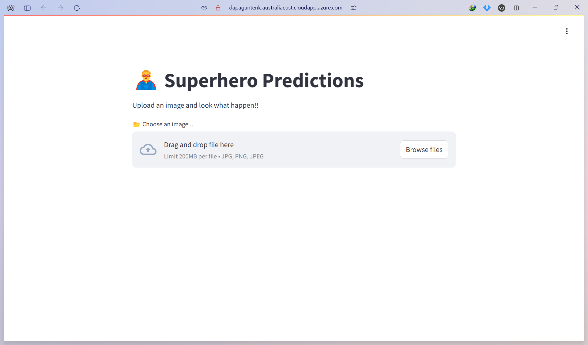

# Superhero Classification

## Anggota Tim
| Nama       | NRP        | Github  |
|------------|------------|---------|
| Daffa Rinali     | 5025231209 | [RinaliDaffa](https://github.com/RinaliDaffa) |
| Algof Kristian Zega | 5025231235 | [algof](https://github.com/algof) |
| Filbert Hainsly Martin | 5025231256 | [FilbertHM](https://github.com/FilbertHainsly) |

## Deskripsi Singkat Project
Kelompok kami membuat sebuah model untuk mengklasifikasi gambar dalam 26 class target superhero menggunakan beberapa pretrained model CNN, YOLOv8, MobileNetV2, ResNet. Dataset yang kami gunakan, kami scraping dari search engine bing images dan berasal dari Marvel dan DC Universe.

## Link Artikel Penjelasan Lengkap
[Make AI Recognize Your Childhood Heroes: A Deep Learning Project](https://medium.com/@filberthainsly17/make-ai-recognize-your-childhood-heroes-a-deep-learning-project-d212fbe2a404)

## Referensi
1. [https://sidharkal.medium.com/image-classification-with-yolov8](https://sidharkal.medium.com/image-classification-with-yolov8-40a14fe8e4bc)
2. [https://www.kaggle.com/code/sidharkal/image-classification-with-yolov8](https://www.kaggle.com/code/sidharkal/image-classification-with-yolov8)
3. [https://github.com/lukemelas/EfficientNet-PyTorch](https://github.com/lukemelas/EfficientNet-PyTorch)
4. [https://github.com/ultralytics/ultralytics](https://github.com/ultralytics/ultralytics)
5. [https://medium.com/@anglilian/image-classification-with-resnet-pytorch](https://medium.com/@anglilian/image-classification-with-resnet-pytorch-1e48a4c33905)
6. [https://github.com/anglilian/rock-classification](https://github.com/anglilian/rock-classification)